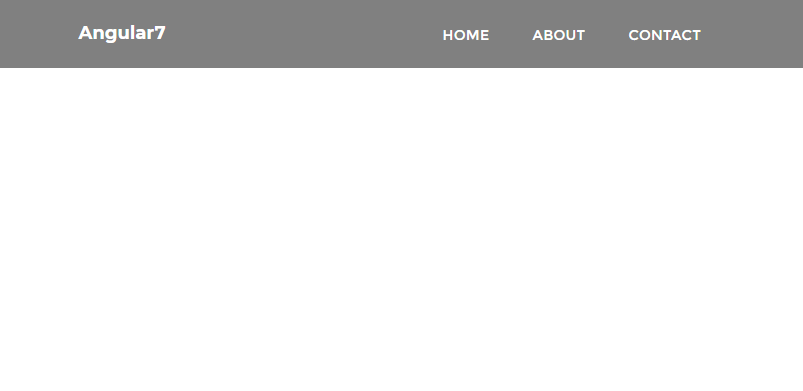
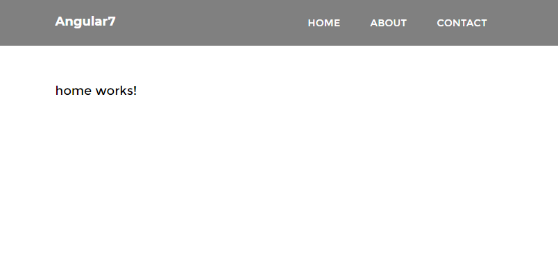
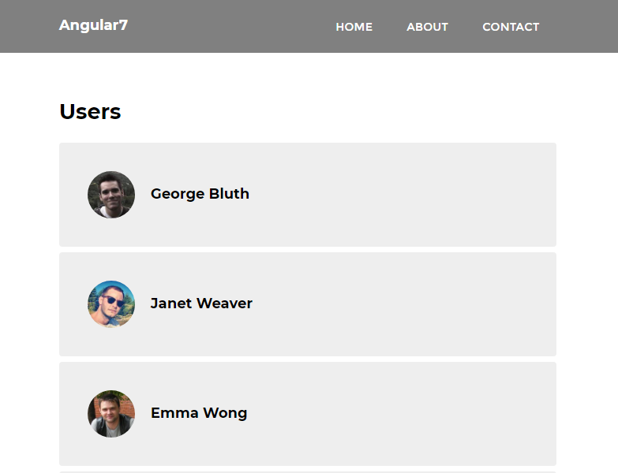
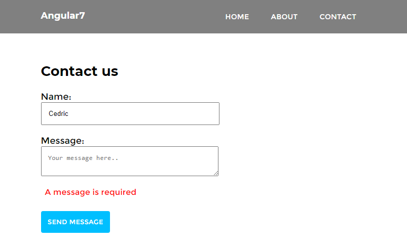

# Ng7

This project was generated with [Angular CLI](https://github.com/angular/angular-cli) version 10.0.0.

## Installation
In order to install the Angular CLI, you will need **Nodejs**. Make sure you install this with the default options and reload your command line or console after doing so.
```
npm install -g @angular/cli
```
Once complete, you can now access the CLI by simply starting any commands with ng. Run the following command to install a new Angular 7 project:
```
ng new ng7
```
It's going to present you with a couple questions before beginning:
```
? Would you like to add Angular routing? Yes
? Which stylesheet format would you like to use? SCSS   [ http://sass-lang.com   ]
```
Go into the new project folder by typing:
```
cd ng7
```
Then run this command to run a development server using the Angular CLI:
```
ng serve -o
```
-o is for open, this flag will open your default browser at http://localhost:4200. Tip: You can type ng to get a list of all available commands, and ng [command] --help to discover all their flags.

## Angular 7 Components
The most basic building block of your Angular 7 application (and this is a concept that's not new) is the component. A component consists of three primary elements:

- The HTML template
- The logic
- The styling (CSS, Sass, Stylus, etc..)

When we use the Angular CLI to start a new project, it generates a single component, which is found in /src/app/:
```
/app.component.html
/app.component.scss
/app.component.ts
```
Let's use the Angular CLI to create our own components that we'll need going forward. In the console, issue the following commands or we can also use a shorthand syntax, which makes life a little bit easier.
```
ng generate component nav
ng g c about
ng g c contact
ng g c home
```
## Angular 7 Templating
You may have noticed that one of the components we generated was called nav. Let's implement a header bar with a navigation in our app!

The first step is to visit the app.component.html file and specify the following contents:
```
<app-nav></app-nav>

<section>
  <router-outlet></router-outlet>
</section>
```
the  consists of a simple paragraph stating as much.

At this point, let's modify the following HTML nav.component.html file to create a simple navigation:
```
<header>
  <div class="container">
    <a routerLink="/" class="logo">{{ apptitle }}</a>
    <nav>
      <ul>
        <li><a routerLink="/">Home</a></li>
        <li><a routerLink="/about">About</a></li>
        <li><a routerLink="/contact">Contact us</a></li>
      </ul>
    </nav>
  </div>
</header>
```
Let's define that property in nav.component.ts:

```
export class NavComponent implements OnInit {

  appTitle: string = 'Angular7';
  // OR (either will work)
  appTitle = 'Angular7';

  constructor() { }

  ngOnInit() {
  }

}
```
## Global style

Let's define some global stylesheet by opening `/src/styles.scss`:
```
@import url('https://fonts.googleapis.com/css?family=Montserrat:400,700');

body, html {
    height: 100%;
    margin: 0 auto;
}

body {
    font-family: 'Montserrat';
    font-size: 18px;
}

a {
    text-decoration: none;
}

.container {
    width: 80%;
    margin: 0 auto;
    padding: 1.3em;
    display: grid;
    grid-template-columns: 30% auto;

    a {
        color: white;
    }
}

section {
    width: 80%;
    margin: 0 auto;
    padding: 2em;
}
```
## Define component style
Let's define a component style by opening
`nav/component.scss`
```
header {
    background: #808080;

    .logo {
        font-weight: bold;
    }

    nav {
        justify-self: right;
    
        ul {
            list-style-type: none;
            margin: 0; padding: 0;

            li {
                float: left;

                a {
                    padding: 1.5em;
                    text-transform: uppercase;
                    font-size: .8em;

                    &:hover {
                        background: #8e8e8e;
                    }
                }
            }
        }
    }
}
```


## Angular 7 Routing
Now that we have a navigation, let's make our  app actually navigate between our components as needed.

Open up `/src/app/app-routing.module.ts`

```

import { HomeComponent } from './home/home.component';
import { AboutComponent } from './about/about.component';
import { ContactComponent } from './contact/contact.component';

const routes: Routes = [
  { path: '', component: HomeComponent },
  { path: 'about', component: AboutComponent },
  { path: 'contact', component: ContactComponent },
];

```
This is what the result should look like in the browser at this point: 


## Angular 7 Services

Services in Angular 7 allow you to define code that's accessible and reusable throughout multiple components. A common use case for services is when you need to communicate with a backend of some sort to send and receive data.
```
ng generate service data
```
Open up the new service file /src/app/data.service.ts and let's create the following method:
```
export class DataService {

  constructor() { }

}
```
To use this in a component `/src/app/home/home`, update the code to the following:
```
import { Component, OnInit } from '@angular/core';
import { DataService } from '../data.service';

@Component({
  selector: 'app-home',
  templateUrl: './home.component.html',
  styleUrls: ['./home.component.scss']
})
export class HomeComponent implements OnInit {

  constructor(private data: DataService) { }

  ngOnInit() {
  }

}
```
There are 2 things happening here:

- We're first importing the DataService at the top.
- We're creating an instance of it through dependency injection within the constructor() function.

## Angular 7 HTTP Client
Angular comes with its own HTTP library that we will use to communicate with a fake API to grab some data and display it on our home template. This will take place within the data.service file that we generated with the CLI.

In order to gain access to the HTTP client library, we have to update `/src/app/app.module.ts` file.
```
import { HttpClientModule } from '@angular/common/http';
```
Next, add it to the imports array:
```
  imports: [
    BrowserModule,
    AppRoutingModule,
    HttpClientModule,    // <-- Right here
  ],
```
Now we can use it in our `/src/app/data.service.ts` file:
```
import { Injectable } from '@angular/core';
import { HttpClient } from '@angular/common/http';  // Import it up here

@Injectable({
  providedIn: 'root'
})
export class DataService {

  constructor(private http: HttpClient) { }

  getUsers() {
    return this.http.get('https://reqres.in/api/users')
  }
}
```
reqres.in is a free public API that we can use to grab data.
Update your `home.component.ts` file with the following:
```
export class HomeComponent implements OnInit {

  users: Object;

  constructor(private data: DataService) { }

  ngOnInit() {
    this.data.getUsers().subscribe(data => {
        this.users = data
        console.log(this.users);
      }
    );
  }

}
```
The first thing you might notice is that we're placing the code inside of the ngOnInit() function, which is a lifecycle hook for Angular. Any code placed in here will run when the component is loaded.

We're defining a users property, and then we're calling the .getUsers() method and subscribing to it. Once the data is received, we're binding it to our users object and also console.logging it.

Give it a try in the browser and you will see the console shows an object that's returned. Let's display it on our home template!

Update `home.component.html` with the following:
```
<h1>Users</h1>

<ul *ngIf="users">
  <li *ngFor="let user of users.data">
    
    <p>{{ user.first_name }} {{ user.last_name }}</p>
  </li>
</ul>
```
Let's add style to `home.component.scss`:
```
ul {
    list-style-type: none;
    margin: 0;padding: 0;

    li {
        background: rgb(238, 238, 238);
        padding: 2em;
        border-radius: 4px;
        margin-bottom: 7px;
        display: grid;
        grid-template-columns: 60px auto;

        p {
            font-weight: bold;
            margin-left: 20px;
        }

        img {
            border-radius: 50%;
            width: 100%;
        }
    }
}
```


## Angular 7 Forms
Let's create a contact form so that you can learn how to use forms in Angular 7.

Angular 7 provides you with two different approaches to dealing with forms: template driven and reactive forms. I'm not going to go into the differences between these two approaches, but reactive forms generally provide you with more control andform validation can be unit tested as opposed to template driven forms.

To get started, we have to update `app.module.ts` file and import the Reactive Forms Module:
```
// other imports
import { ReactiveFormsModule } from '@angular/forms';

// other code
  imports: [
    BrowserModule,
    AppRoutingModule,
    HttpClientModule,
    ReactiveFormsModule  // <- Add here
  ],
```
then update `contact.component.ts` file with the following:
```
import { Component, OnInit } from '@angular/core';
import { FormBuilder, FormGroup, Validators } from '@angular/forms';


@Component({
  selector: 'app-contact',
  templateUrl: './contact.component.html',
  styleUrls: ['./contact.component.scss']
})
export class ContactComponent implements OnInit {

  messageForm: FormGroup;
  submitted: boolean = false;
  success: boolean = false;
  
  constructor(private formBuilder: FormBuilder) {
    this.messageForm = this.formBuilder.group({
      name: ['', Validators.required],
      message: ['', Validators.required]
    })
  }

  onSubmit() {
    this.submitted = true;
    if (this.messageForm.invalid){
      return;
    }
    this.success = true
  }

  ngOnInit(): void {
  }

}

```
Then, update `contact.component.html` with the following:
```
<h1>Contact us</h1>

<form [formGroup]="messageForm" (ngSubmit)="onSubmit()">

    <h5 *ngIf="success">Your form is valid!</h5>

    <label>
      Name:
      <input type="text" formControlName="name">
      <div *ngIf="submitted && messageForm.controls.name.errors" class="error">
        <div *ngIf="messageForm.controls.name.errors.required">Your name is required</div>
      </div>
    </label>
  
    <label>
      Message:
      <textarea formControlName="message"></textarea>
      <div *ngIf="submitted && messageForm.controls.message.errors" class="error">
        <div *ngIf="messageForm.controls.message.errors.required">A message is required</div>
      </div>
    </label>

    <input type="submit" value="Send message" class="cta">
  
  </form>

```
Let's update the style for the component to make it look better:

```
label {
    display: block;
    
    input, textarea {
        display: block;
        width: 50%;
        margin-bottom: 20px;
        padding: 1em;
    }

    .error {
        margin-top: -20px;
        background: yellow;
        padding: .5em;
        display: inline-block;
        font-size: .9em;
        margin-bottom: 20px;
    }
}

.cta {
    background: #00bfff;
    border: none;
    color: white;

    text-transform: uppercase;
    border-radius: 4px;
    padding: 1em;
    cursor: pointer;
    font-family: 'Montserrat';
}
```
Save it, and the result in the browser should look like this!

